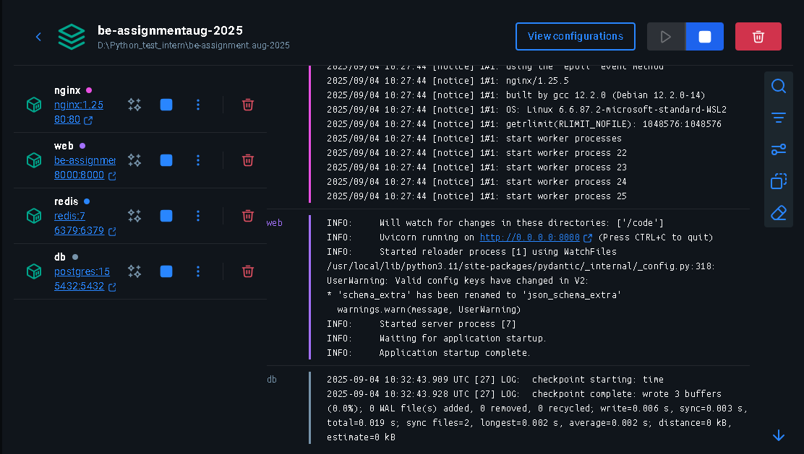
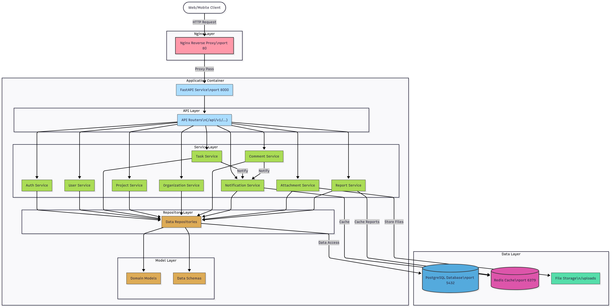
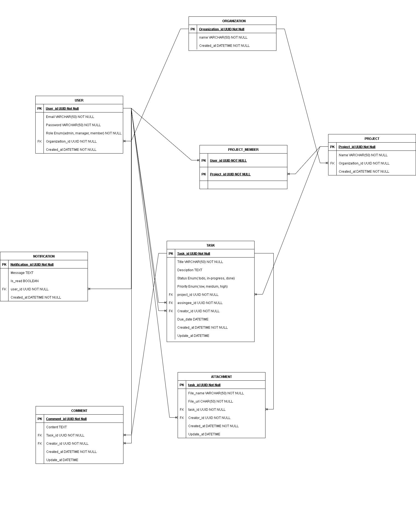
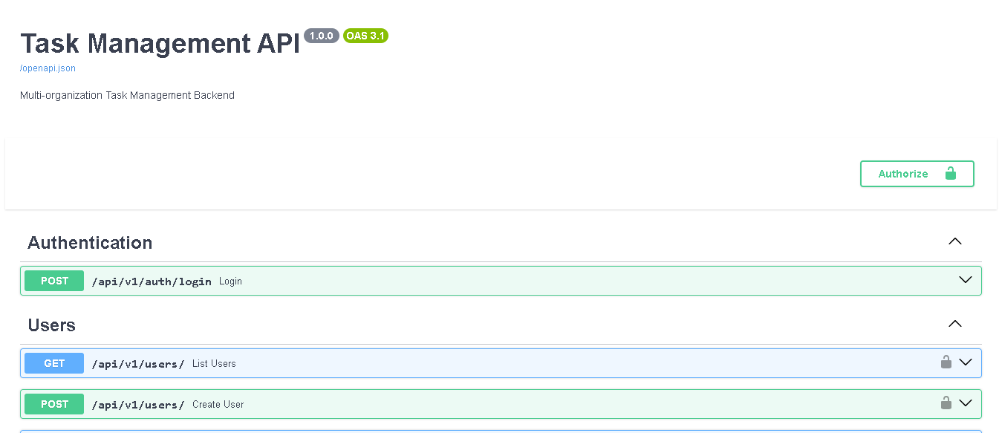
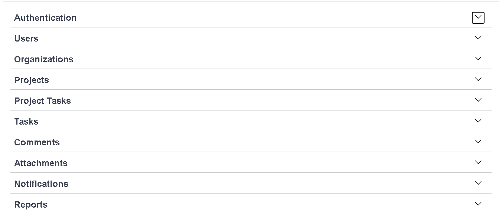
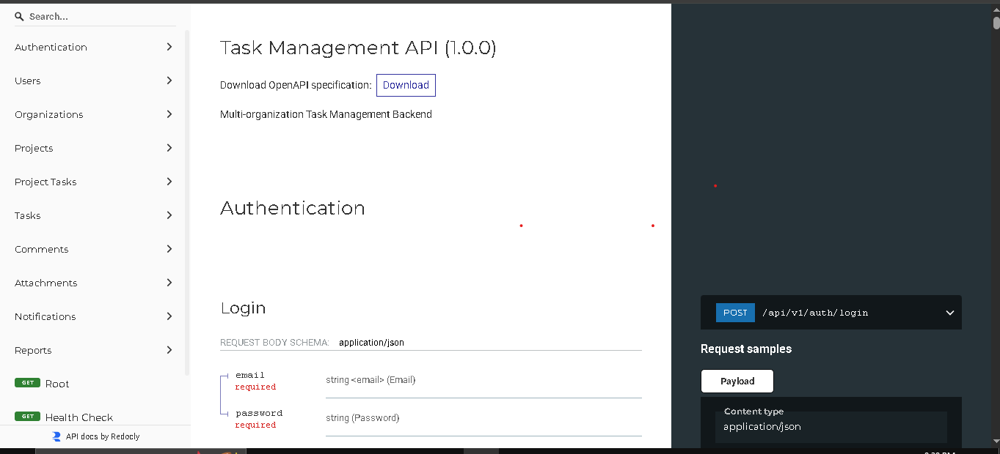

# BE Assignment Aug 2025

📑 **Intern Backend Developer Assignment**  
Copyright (c) River Flow Solutions, Jsc. 2025. All rights reserved.  
We only use the submissions for candidates evaluation.

---

## 🚀 Giới thiệu

Dự án **Task Management Backend** được xây dựng trong khuôn khổ **bài test Intern Backend Developer**.  
Mục tiêu: xây dựng hệ thống quản lý nhiều tổ chức (multi-organization), hỗ trợ dự án, nhiệm vụ, thành viên, bình luận, thông báo và báo cáo.  

---

## 🛠️ Công nghệ & Công cụ

- **Ngôn ngữ:** Python (FastAPI, SQLAlchemy, Alembic)  
- **CSDL:** PostgreSQL  
- **Cache/Notify:** Redis (cache, pub/sub)  
- **Proxy:** Nginx  
- **Triển khai:** Docker + Docker Compose  
- **Task runner:** Justfile  
- **Auth:** JWT + Role-based access (Admin, Manager, Member)  

---

## 🔧 Hướng dẫn cài đặt

### 1. Clone repo

```bash
git clone https://github.com/dinhlooc/be-assignment-aug-2025-private.git
cd be-assignment-aug-2025-private
```

### 2. Build Docker image

```bash
just docker-build
```

### 3. Chạy container

```bash
just docker-run
```

Ứng dụng sẽ chạy tại:

- **Nginx Proxy:** [http://localhost](http://localhost)  
- **FastAPI Service trực tiếp:** [http://localhost:8000](http://localhost:8000)  

### 4. Khởi tạo database

```bash
just docker-db-setup
```

### 5. Seed dữ liệu mẫu

```bash
just docker-db-seed
```

---

## 🏗️ Kiến trúc hệ thống

### Tổng quan container



### Kiến trúc logic



- Nginx (proxy) → FastAPI (backend) → PostgreSQL (database)  
- Redis hỗ trợ cache và pub/sub notification  

### Sơ đò ERD
-    

---

## 📖 Swagger UI / API Docs

- Swagger UI (qua Nginx Proxy): [http://localhost/docs#/](http://localhost/docs#/)  
- Swagger UI (trực tiếp FastAPI): [http://localhost:8000/docs#/](http://localhost:8000/docs#/)  
- ReDoc: [http://localhost:8000/redoc](http://localhost:8000/redoc)  

Ảnh giao diện Swagger:  
  
  

Ảnh giao diện Swagger:  
  

---

## 📂 Cấu trúc thư mục

```
.
├── app/                # Source code FastAPI (routers, services, repositories, schemas, models)
├── scripts/            # Script setup, seed DB
├── tests/              # Unit & integration tests
├── image/              # Ảnh minh họa (docker.png, swagger.png)
├── docker-compose.yml
├── Justfile
└── README.md
```

---

## ⚙️ Các lệnh Justfile

```make
# Install dependencies
install:
    pip install -r requirements.txt

# Install development dependencies
install-dev:
    pip install -r requirements-dev.txt

# Run the application
run:
    uvicorn app.main:app --reload --host 0.0.0.0 --port 8000

# Run tests
test:
    pytest tests/ -v --cov=app --cov-report=term-missing

# Run tests with coverage report
test-cov:
    pytest tests/ --cov=app --cov-report=html

# Format code
format:
    black app/ tests/
    isort app/ tests/

# Lint code
lint:
    flake8 app/ tests/
    black --check app/ tests/
    isort --check-only app/ tests/

# Type checking
type-check:
    mypy app/

# Database migrations
db-migrate:
    alembic revision --autogenerate -m "{{message}}"

db-upgrade:
    alembic upgrade head

db-downgrade:
    alembic downgrade -1

# Seed database
seed:
    python scripts/seed.py

# Setup database
setup-db:
    python scripts/setup_db.py

# Docker commands
docker-build:
    docker build -t task-management-backend .

docker-run:
    docker-compose up -d

docker-stop:
    docker-compose down

docker-logs:
    docker-compose logs -f

docker-db-setup:
    docker-compose exec web python scripts/setup_db.py

# Docker database seed
docker-db-seed:
    docker-compose exec web python scripts/seed.py

# Development setup
dev-setup: install-dev setup-db seed
    @echo "Development environment setup complete!"

# Clean up
clean:
    find . -type f -name "*.pyc" -delete
    find . -type d -name "__pycache__" -delete
    find . -type d -name "*.egg-info" -delete
    rm -rf .coverage htmlcov/

# Show help
default:
    @just --list
```

---

## 🧪 Kiểm thử

Chạy test:

```bash
just test
```

Coverage report:

```bash
just test-cov
```

---

